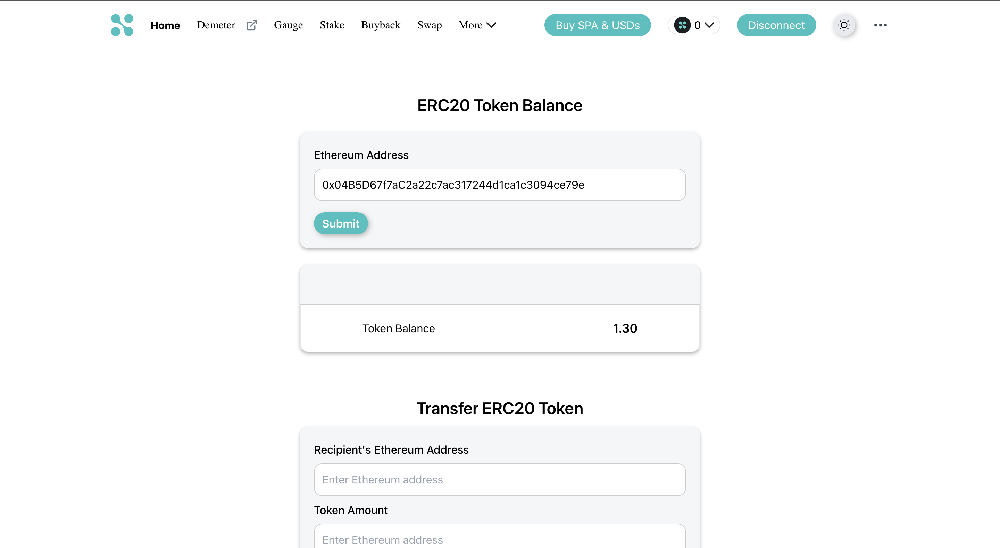
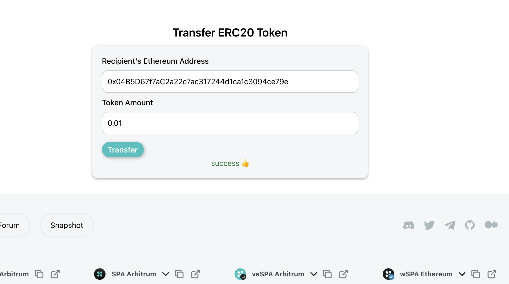

# ERC20 Token Management App

This is a React application that allows users to interact with ERC20 tokens on the Ethereum blockchain. It provides functionality to display the ERC20 token balance for a given Ethereum address and transfer ERC20 tokens to another address from connected metamask wallet.

## Demo

### The ERC20 Token Management App is deployed on Vercel. You can access it [here](https://sperax-assignment-six.vercel.app/).

## Supported ERC20 Information

- Token Name: `TST`
- Network Name: `Polygon Mumbai Testnet`
- Chain ID: `80001`
- Contract Address: `0x25a583f7e0c7defe9d5abb09e84786f5566fe93f`    

## Installation

### Clone the repository:
    git clone https://github.com/assassinxoxo/sperax-assignment.git
### Install dependencies:
    cd sperax-assignment
    npm install
### Run the application:
    npm start

## Configuration
### The ERC20 Token Management App uses a config.js file to define the contract and network settings. To modify the contract address and network, follow these steps:

- Open the src/config.js file in a text editor.
- Update the network RPC URL with the RPC URL of your desired Ethereum network.
- Update the contract address with the Ethereum address of your desired ERC20 token contract.
- Update the contract ABI with the ABI of your desired ERC20 token contract.
- Update the network with the name or ID of the Ethereum network you want to connect to (e.g., Mainnet, Ropsten, Rinkeby, Ploygon etc.).

#### Note: Make sure that the contract you're using is deployed on the specified network.

## Prerequisites

- Node.js
    - Install Node.js from [here](https://nodejs.org/en/download/)
- MetaMask wallet
  - Install MetaMask extension on your browser
  
## User Interface

### The ERC20 Token Management App provides a user-friendly and visually appealing interface for interacting with ERC20 tokens. It follows a clean and simple design approach.

- Display ERC20 Token Balance:

  - A form layout with a text input field for entering the Ethereum address.
  - A "Submit" button to initiate the balance retrieval process.
  - The fetched balance is prominently displayed on the screen using a visually appealing component such as a card or a large text element.
  - An appropriate error message is displayed if the input is invalid.
- Transfer ERC20 Tokens:
  - A form layout with separate fields for entering the recipient's Ethereum address and the token amount.
  - Real-time validation is implemented for the Ethereum address and token amount fields.
  - An appropriate error message is displayed below each field if the inputs are invalid or if there are any transfer-related errors.

## Screenshots

### Display ERC20 Token Balance

### Transfer ERC20 Tokens
